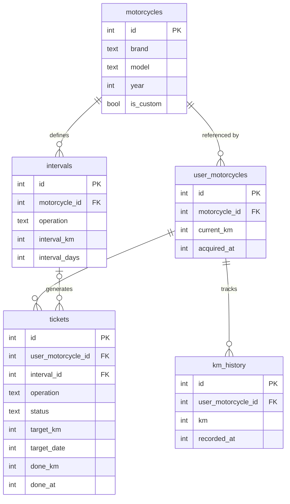

# Pitlog

> Motorcycle maintenance logbook — predictive alerts, kanban board, LLM-assisted diagnostics.

[](https://github.com/LouisBis/pitlog/actions/workflows/ci.yml)
[](https://github.com/LouisBis/pitlog/actions/workflows/deploy.yml)
[](https://louisbis.github.io/pitlog/)


## Concept

Pitlog is a mobile-first PWA that turns your maintenance schedule into an actionable kanban board. Tickets are color-coded by urgency based on mileage and time, regenerate automatically when completed, and predict when your next service is due based on your riding velocity.

## Modules

### **Module 1 — Maintenance Kanban (core)**

- Multi-motorcycle garage — add any bike by brand / model / year
- Catalogue matching: recognised models auto-seed tickets from predefined service intervals; unrecognised models fall back to a generic template
- Board with columns: `To do` / `Part ordered` / `In progress` / `Done`
- Tickets color-coded by urgency: 🔴 ≤ 200 km or ≤ 14 days / 🟠 ≤ 500 km or ≤ 30 days / 🟢 otherwise
- Predictive mileage: estimates due dates based on your riding velocity (sliding window km/day)
- Auto-regeneration: completing a ticket creates the next one automatically
- Drag & drop between columns

### **Module 2 — LLM Diagnostics (Phase 3)**

- Natural language chat: "metallic noise on acceleration"
- Voice input via Web Speech API
- Motorcycle context injected automatically into the prompt
- Local LLM via Ollama (llama3.2) on VPS, streamed response

## Data model



## Architecture

The client and server are fully decoupled — the React SPA communicates with the Express API over REST, and can run standalone via MSW for the GitHub Pages demo.

A few deliberate choices worth noting:

- **SQLite over PostgreSQL** — single-user app, zero ops overhead, file-based persistence via a Docker volume. [ADR-002](docs/adr/002-sqlite-vs-postgres.md)
- **Zustand + TanStack Query** — Zustand handles ephemeral UI state (drag, modals), TanStack Query owns server state and cache invalidation. No overlap, no boilerplate. [ADR-003](docs/adr/003-state-management.md)
- **Sliding window velocity** — km/day is computed over the last 10 odometer entries, not lifetime average. Recent riding behavior predicts near-term due dates better. [ADR-005](docs/adr/005-predictive-velocity.md)
- **MSW for the demo** — no backend on GitHub Pages. MSW intercepts fetch calls at the service worker level and returns realistic stateful mock data. [docs/adr/](docs/adr/)

Full decision log: [docs/adr/](docs/adr/) (ADR-001 to ADR-011)

## Stack

| Layer           | Tool                              |
| --------------- | --------------------------------- |
| Frontend        | React 19 + TypeScript, Vite       |
| State           | Zustand + TanStack Query          |
| i18n            | react-i18next                     |
| Drag & drop     | dnd-kit                           |
| Backend         | Express 5 + Node.js               |
| Database        | SQLite + Drizzle ORM              |
| Logging         | loglevel (client) + Pino (server) |
| Mocks           | MSW                               |
| Dev environment | Docker                            |

## Structure

```text
pitlog/
  client/     # React + TypeScript
  server/     # Express + Node.js
  docs/
    adr/      # Architecture Decision Records (ADR-001 to ADR-009)
```

## Getting started

**Requirements**: Docker + Docker Compose.

```bash
git clone git@github.com:LouisBis/pitlog.git
cd pitlog
./dev.sh
```

The script opens an interactive menu. To start the full stack:

```text
1) Start   →  docker compose up -d
```

| URL | Service |
| --- | ------- |
| [localhost:5173](http://localhost:5173) | React client |
| [localhost:3001](http://localhost:3001) | Express API |
| [localhost:3001/health](http://localhost:3001/health) | Health check |

To run server tests, use option `7` from the menu.

---

_Pitlog — "Journal de bord de tes révisions"_
