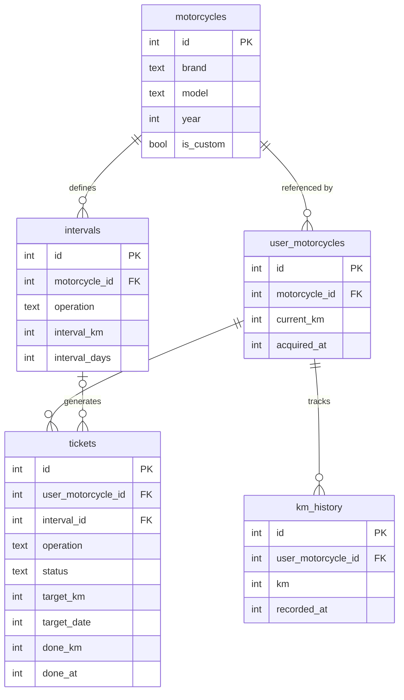

# Pitlog

> Motorcycle maintenance logbook — predictive alerts, kanban board, LLM-assisted diagnostics.

## Concept

Pitlog is a mobile-first PWA that turns your maintenance schedule into an actionable kanban board. Tickets are color-coded by urgency based on mileage and time, regenerate automatically when completed, and predict when your next service is due based on your riding velocity.

## Modules

**Module 1 — Maintenance Kanban (core)**
- Board with columns: `To do` / `In progress` / `Part ordered` / `Done`
- Tickets color-coded by urgency: 🔴 < 200km or < 30d / 🟠 < 500km or < 90d / 🟢 > 500km
- Predictive mileage: estimates due dates based on your riding velocity
- Auto-regeneration: completing a ticket creates the next one automatically
- Drag & drop + mobile swipe

**Module 2 — LLM Diagnostics (Phase 3)**
- Natural language chat: "metallic noise on acceleration"
- Voice input via Web Speech API
- Motorcycle context injected automatically into the prompt
- Local LLM via Ollama (llama3.2) on VPS, streamed response

## Data model



## Stack

| Layer | Tool |
| --- | --- |
| Frontend | React 19 + TypeScript, Vite |
| State | Zustand + TanStack Query |
| i18n | Lingui |
| Drag & drop | dnd-kit |
| Backend | Express 5 + Node.js |
| Database | SQLite + Drizzle ORM |
| Logging | loglevel (client) + Pino (server) |
| Mocks | MSW |
| Dev environment | Docker |

## Structure

```text
pitlog/
  client/     # React + TypeScript
  server/     # Express + Node.js
  docs/
    adr/      # Architecture Decision Records (ADR-001 to ADR-009)
```

## Getting started

```bash
docker compose up --build
```

---

*Pitlog — "Journal de bord de tes révisions"*
